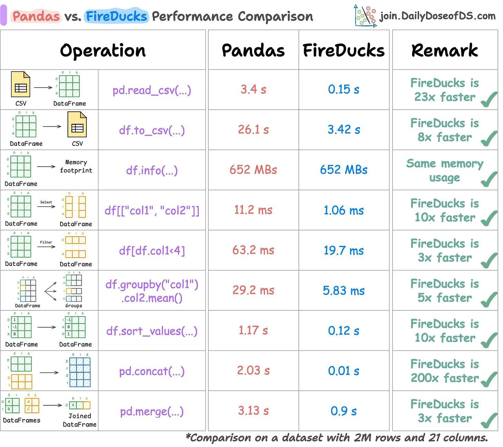

# Agent Implementations

The implementation of each agent is provided in Python code. Each agent is designed to perform a specific task related to data analysis using the dataset provided. The agents are responsible for:

### Data Detective Agent
Identifying data issues such as missing values, anomalies, and outliers.

### Marketing Performance Agent
Analyzing key marketing metrics such as cost per transaction, revenue per spend, and conversion rates.

### Customer Journey Agent
Analyzing how customers move through different stages of the funnel (from pageview to transaction) and identifying drop-offs.

### Revenue Intelligence Agent
Analyzing the revenue generated by various traffic sources and identifying patterns.

These agents are defined using functions that process and analyze the cleaned dataset.

  
  
  

# Analysis Notebooks

These notebooks guide the user through the analysis process step-by-step. They include the following sections:

## Data Loading and Preprocessing
Includes cleaning the data and making it ready for analysis.

## Agent Execution
Running each agent and displaying the results.

## Visualizations
Using charts or tables to make the results more understandable.

## Report Generation
Generating insights based on agent outputs, including key findings and recommendations.

  
  
  

# Agent Descriptions

1. **Data Detective Agent**
   - **Purpose**: Identifies anomalies in the data, such as missing values or outliers that could skew the analysis.
   - **Methods**: Checks for missing data, investigates statistical summaries for outliers, and identifies inconsistencies or anomalies in the dataset.

2. **Marketing Performance Agent**
   - **Purpose**: Evaluates the effectiveness of marketing campaigns by calculating key metrics like conversion rates, cost per transaction, and revenue per spend.
   - **Methods**: Aggregates data by marketing source, calculates conversion rates, cost per transaction, and revenue per spend, and compares the performance of different sources.

3. **Customer Journey Agent**
   - **Purpose**: Analyzes customer behavior through various stages of the purchasing funnel (pageviews, clicks, add to cart, checkout, transactions).
   - **Methods**: Calculates key funnel metrics like click-to-cart rate, cart-to-checkout rate, and checkout-to-transaction rate, and identifies where customers drop off.

4. **Revenue Intelligence Agent**
   - **Purpose**: Helps analyze the overall revenue generation from different traffic sources and identifies which sources contribute the most to revenue.
   - **Methods**: Calculates revenue per visit, revenue per pageview, and aggregates the revenue generated by each traffic source.

  
  
  

# Analysis Methodology

The analysis is carried out in the following steps:

## Data Preprocessing
Clean the dataset by converting columns into the appropriate data types, removing non-numeric symbols (e.g., currency), and handling any missing or inconsistent data.

## Agent Execution
Run each agent to analyze different aspects of the data:
- Data Detective Agent to find anomalies.
- Marketing Performance Agent to calculate performance metrics.
- Customer Journey Agent to analyze the sales funnel.
- Revenue Intelligence Agent to analyze revenue generation.

## Metrics Calculation
For each agent, compute the relevant key performance indicators (KPIs), like conversion rates, cost per transaction, and revenue per spend.

## Results Interpretation
Review the aggregated results from each agent to derive insights and formulate business recommendations.

  
  
  

# Special Mention

We use FireDucks here because it significantly accelerates our pandas-based workflows with minimal changes. By leveraging its lazy execution model, FireDucks optimizes performance and resource utilization. This allows us to process large datasets efficiently while keeping costs and environmental impact low. Its compatibility with the pandas API ensures an easy transition without requiring extensive rework.

Learn more about FireDucks [here](https://fireducks-dev.github.io/docs/user-guide/01-intro/).
